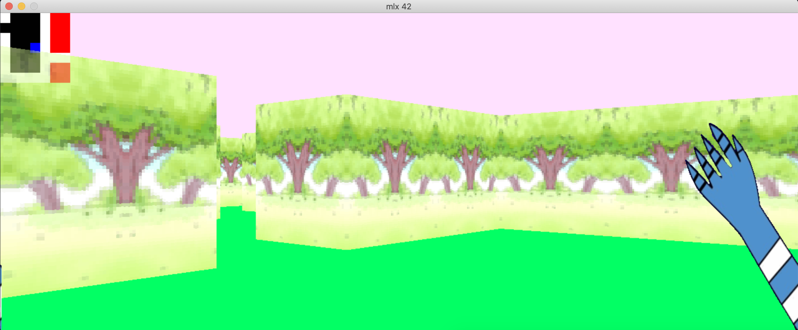
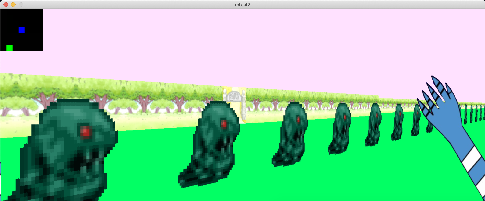

## Cub3D

This project, cub3D, is inspired by the iconic Wolfenstein 3D, the first first-person shooter (FPS) game. The goal is to create a 3D graphical representation of a maze from a first-person perspective using ray-casting principles. Developed in C and utilizing the miniLibX graphical library, the project focuses on rendering a dynamic, realistic 3D maze environment with keyboard-driven interaction.

Participants will develop proficiency in C programming, mathematical algorithms, and graphical rendering techniques. They will also improve their understanding of event handling, memory management, and graphical systems. The project is a platform to apply mathematical concepts in creating interactive and efficient algorithms. Optional bonus features, such as wall collisions, a minimap, and animated sprites, enhance the overall experience.

By completing this project, participants will strengthen their skills in software development and problem-solving in a game-like environment.


## Screenshots




  
## How to use 

You can simply just write 'make' in your command prompt to compile project

```bash 
    make
    ./cub3D ./maps/map_basic.cub
```

To compile bonus part

```
    make bonus
    ./cub3D_bonus ./maps/map.cub
```

## Map characters

- 1 -> Wall
- 0 -> Floor
- N, E, S, W -> Player location and look angle
- 2 -> Door (Bonus part)
- U -> Animated sprite (Bonus part)

## Features in bonus part

- Move camera with mouse
- Music
- Animated sprite
- Door mechanic
- Minimap

  
## Contributors

- [@emirhangumus](https://www.github.com/emirhangumus) project temmate.

  
## Lisans

[MIT](https://choosealicense.com/licenses/mit/)